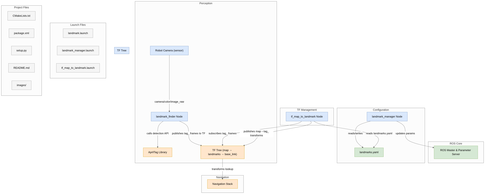

# AR Tag Landmark-Based Autonomous Navigation

This ROS package enables autonomous navigation by using AR tags (AprilTags) as landmarks. Robots equipped with cameras can navigate accurately to specified locations while avoiding obstacles by identifying predefined AR tags.

## Repository Workflow
<div align="center">
  
</div>

## Features

* **AR Tag Landmarks:** Use AprilTags as navigational points.
* **Dynamic Landmark Configuration:** Easily manage landmarks using YAML files.
* **Integration with TF:** Automatically manages and publishes transforms to the ROS TF tree.
* **CLI Management:** Define and update landmarks through a simple command-line interface.

---

## Installation

Ensure dependencies are installed:

* [AprilTag Module](../../interbotix_perception_toolbox/interbotix_perception_modules/src/interbotix_perception_modules/apriltag.py)

Clone this repository:

```bash
cd ~/catkin_ws/src
git clone https://github.com/ArghyaChatterjee/april-tag-based-autonomous-navigation.git
cd ~/catkin_ws
catkin_make
```

---

## Landmark Configuration

Landmarks are defined in YAML configuration files ([example](landmarks/landmarks.yaml)):

```yaml
landmark:
  mounted: true          # True if AR tag is wall-mounted
  offset: 0.5            # Distance offset from the tag for navigation goal
  id: 1                  # AprilTag ID
  label: "Entrance"       # Landmark label
  set: false             # Automatically managed; do not manually set
```

---

## Modules and Nodes

### Modules

* **Landmark:** Stores landmark data, computes transforms, and manages landmark poses.
* **LandmarkCollection:** Manages collections of landmarks with additional utilities.

### Nodes

* **landmark\_manager:**

  * CLI to define landmarks interactively.

<div align="center">
  
</div>

* **landmark\_finder:**

  * Periodically captures images from a camera to detect landmarks, publishing their poses to the TF tree.

* **tf\_map\_to\_landmark:**

  * Publishes transforms between a fixed frame (usually map) and landmarks to organize the TF tree.

---

## Usage

Include necessary launch files in your main ROS launch configuration from the [launch](launch/) directory.

### Launch File Arguments

#### landmark.launch

| Argument             | Description                                 | Default                    |
| -------------------- | ------------------------------------------- | -------------------------- |
| apriltag\_ns         | Namespace for AprilTag nodes and parameters | `apriltag`                 |
| camera\_color\_topic | ROS topic for camera color images           | `camera/color/image_raw`   |
| camera\_info\_topic  | ROS topic for camera info                   | `camera/color/camera_info` |
| use\_cam             | Launch RealSense camera package             | `true`                     |

#### landmark\_manager.launch

| Argument         | Description                        | Default                                                        |
| ---------------- | ---------------------------------- | -------------------------------------------------------------- |
| landmark\_config | Path to landmark YAML config file  | [landmarks.yaml](landmarks/landmarks.yaml)                     |
| fixed\_frame     | Frame to transform landmark TFs    | `landmarks`                                                    |
| obs\_frame       | Observation frame for landmarks    | `camera_color_optical_frame`                                   |
| standalone\_tags | Individual AprilTags to search for | See [landmark\_manager.launch](launch/landmark_manager.launch) |

---

## Troubleshooting

### Landmark Issues

* **"File at `<filepath>` does not exist yet. No landmarks loaded."**

  * Ensure the YAML file exists and is correctly formatted.

---

## Future Work

* Special landmark labels triggering custom behaviors (e.g., docking procedures).

---

## Acknowledgments

Thanks to [Interbotix ROS](https://github.com/Interbotix/interbotix_ros_toolboxes/tree/main/interbotix_common_toolbox/interbotix_landmark_modules) for their open-source contributions.
